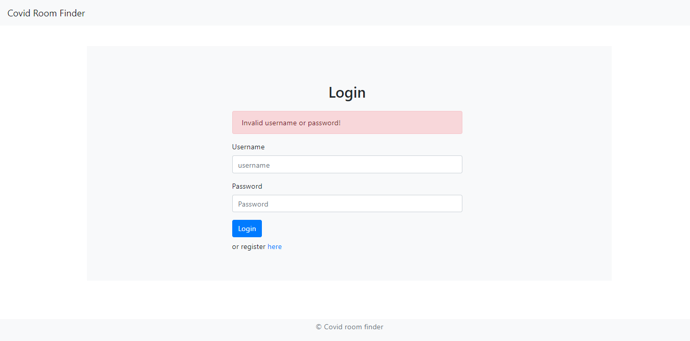
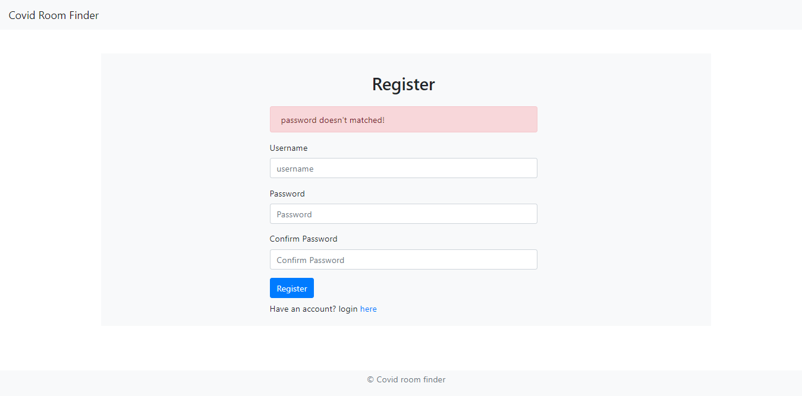
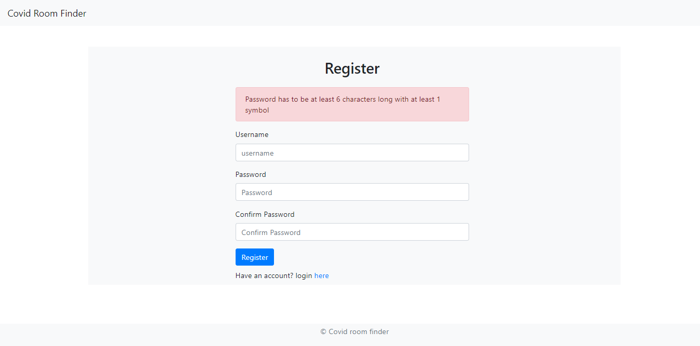
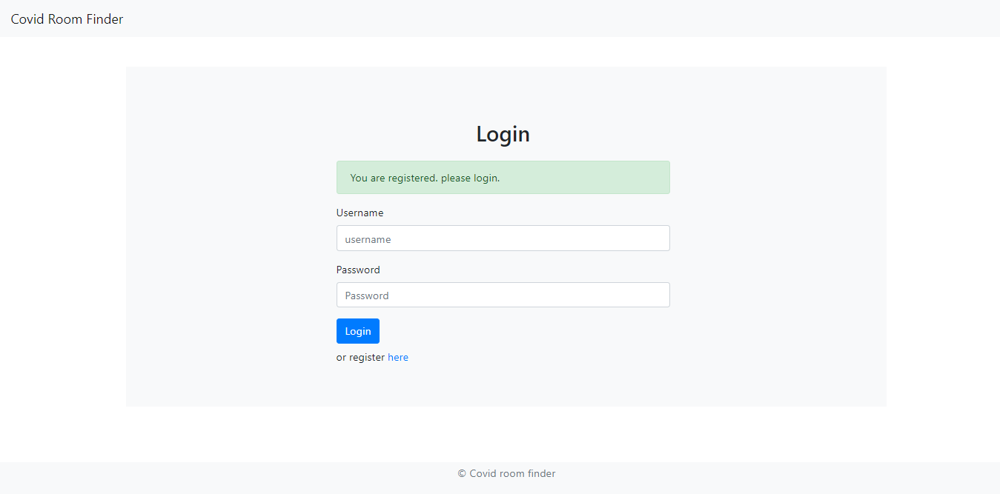
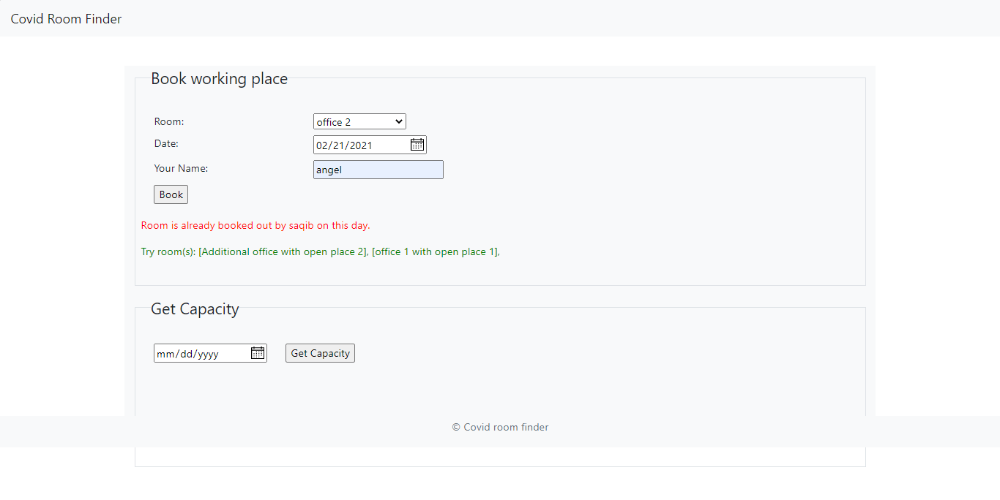
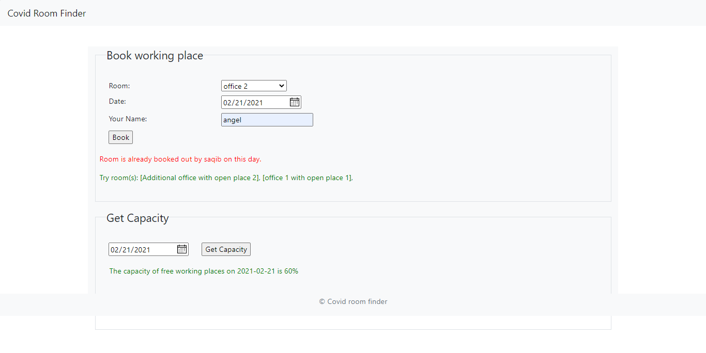
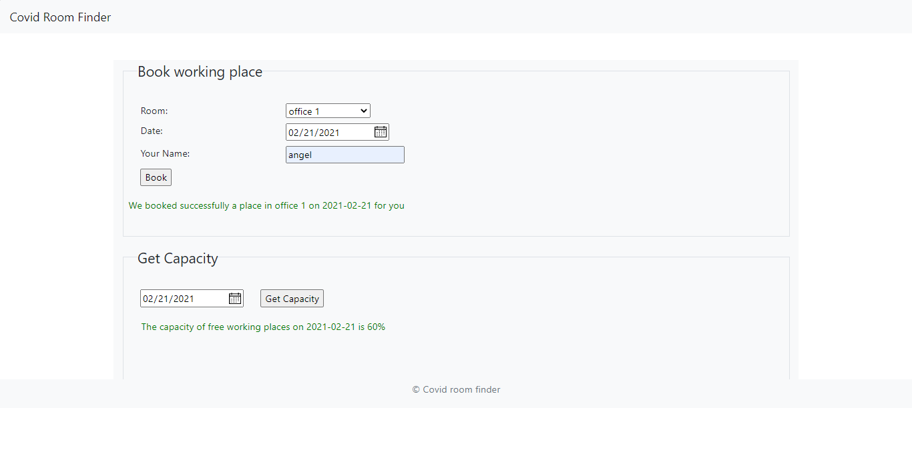

# covid-room-finder-application

a simple covid room finder web application developed in Node Js and MySql database was used.

### Snapshots of the web application

For the error messages I used **express-flash** dependancy.

Error message in Login form

All error messages in register form

After register success a success message will appear to login page. For login authentication **JWT authentication** use and time set for 1hr. a logged in user need to login again after 1hr when jsonwebtoken expires.

if room already booked and no spaces available then a red message will appear in the frontend who were booking along with a green message as suggetion which rooms are available with places on the particular date.

A user can get free space capacity in parcentage by searching on the specific date

If there is empty place for booking, user can book the place on the specific date. A success message will appear in the frontend and show that **we booked a place in which offic on what date** after successfully book a place in a room by the user.

